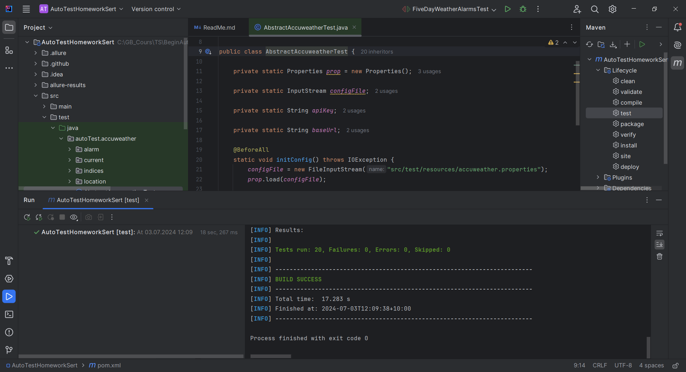
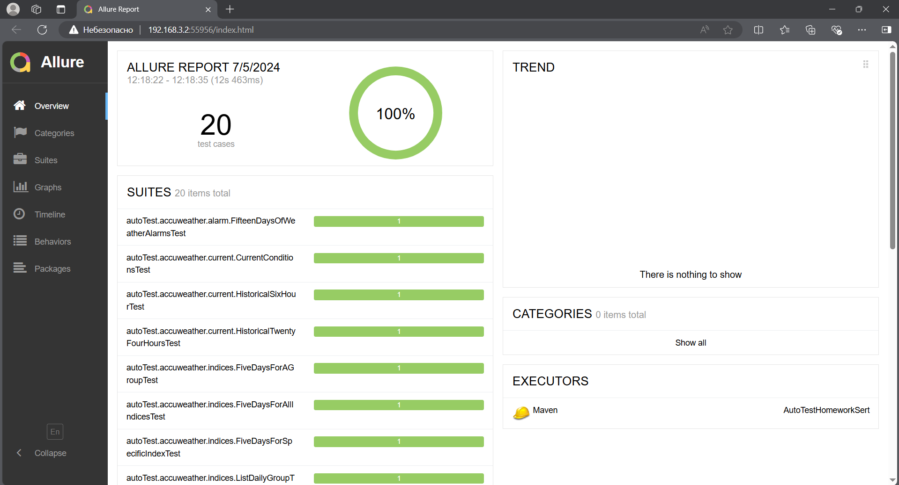
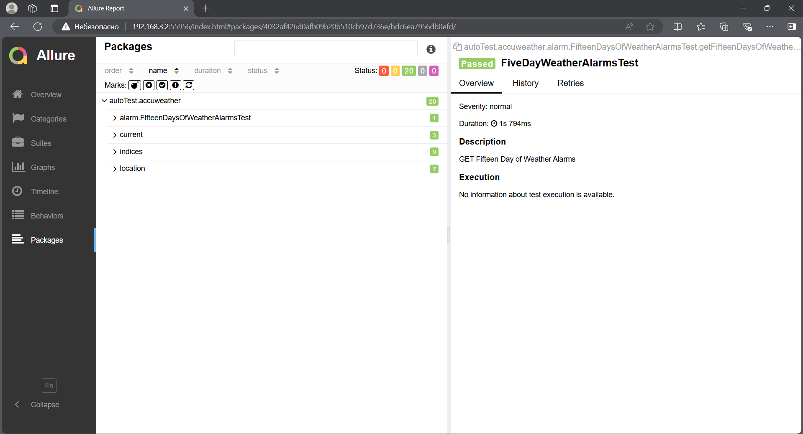
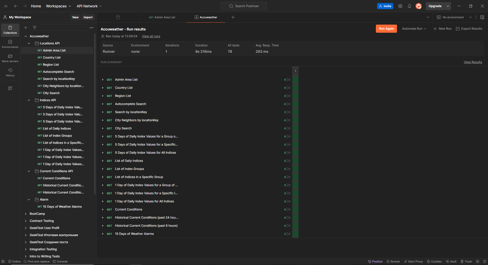

# Семинар: CI/отчеты
Продолжаем работать с коллекцией проекта AccuWeather.

Используем коллекцию запросов которую демонстрировали на 3 лекции
Вам необходимо:
1. Добавить Allure к своему проекту;
2. Добавить аннотации Allure для формирования отчета;
3. Запустить тесты в автоматическом режиме с помощью GitHub Actions;
4. Запушить проект в GIT.

Если вы брали другой проект - продолжайте работать с ним.

--------------------------------------------
## Test-Run проекта

--------------------------------------------
## Allure report

--------------------------------------------
## Test-Run Postman
